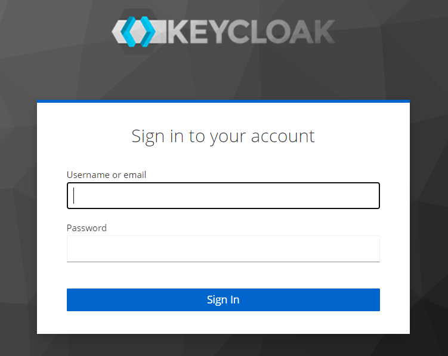
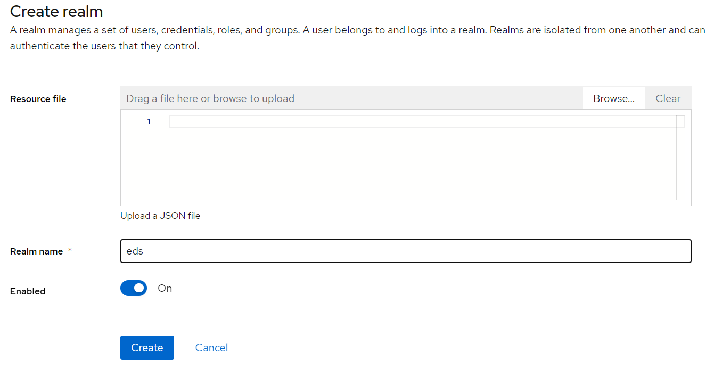
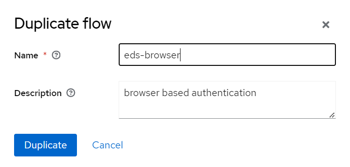
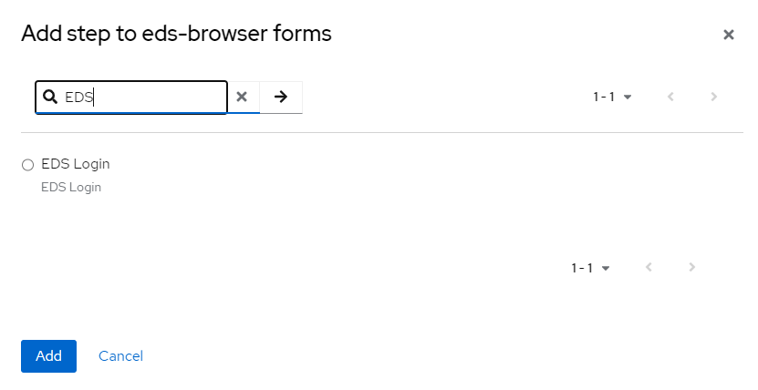
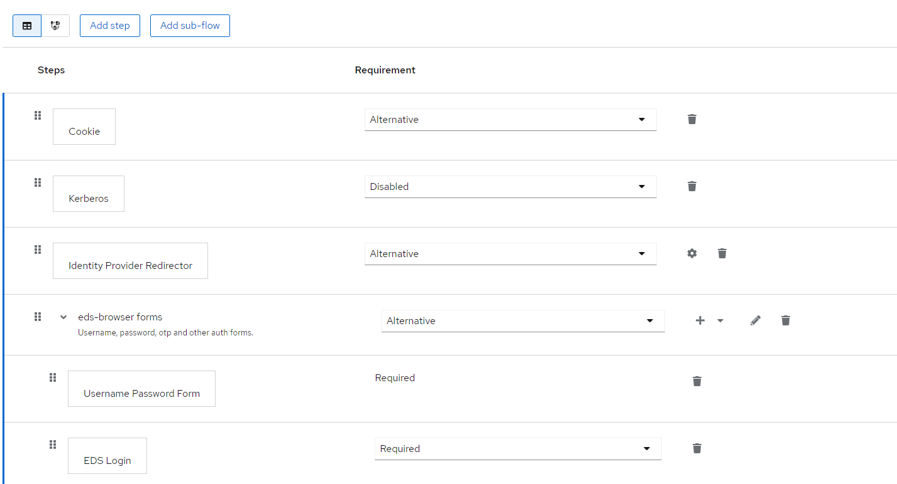
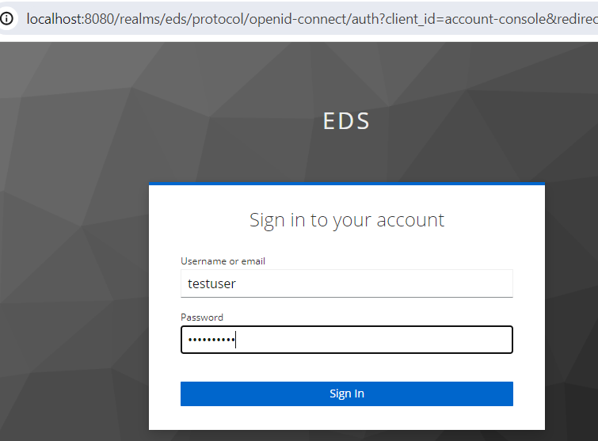
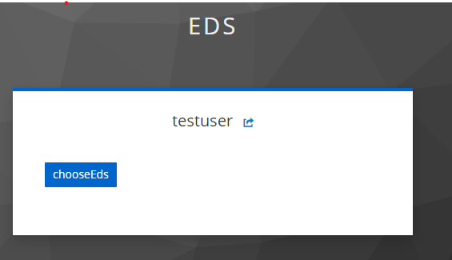
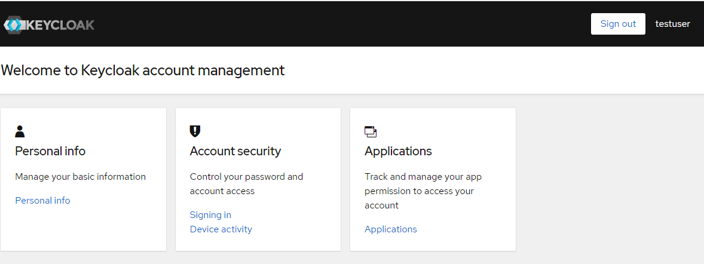

- Open your browser and navigate to http://localhost:8080



- Log in using the following credentials: Username - `user` and Password - `bitnami`.
- Create a new realm. For this example, we will name it `eds`.

- Go to the `Authentication` tab and create a copy of the `Browser flow` using the `Duplicate` button.

- Set the flow name to `eds-browser` (for example), and then click `Save`.
- Configure the authentication flows to meet your business requirements. For plugin testing, we will remove the `Conditional OTP` step.
- Add a new step by searching for our plugin - `EDS Login`. Select it and mark it as `Required`.


- Afterwards, click on the three dots by our new flow - `eds-browser`. Click `Bind flow`, choose `Browser flow` as the `Binding type`, and then click `Save`
- For testing, create a new user. For example, create a user with the credential `testuser/Password1!` and add the following attributes:
```
userClass with value 123456789021
initials with value 123456789011
```
10. Open a new browser tab, and navigate to http://localhost:8080/realms/eds/account/#/.


   - Enter the username/password: `testuser/Qwerty1!`
   - Select AUTH_RSA for your juridical person, enter the password, and verify that you are successfully logged into the system.


